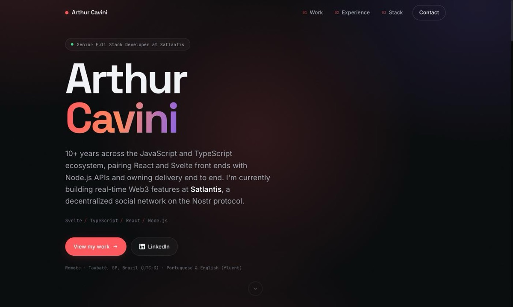

# arthurcavini.com

My personal portfolio — a single static page, hand-written, no framework and no build step.

**Live:** [arthurcavini.com](https://www.arthurcavini.com/)



---

## Why it's built this way

The site is three files — `index.html`, `css/home.css`, `js/app.js` — served exactly as written. No bundler, no dependencies, no `node_modules`, nothing to install. Clone it and open `index.html`.

That's a deliberate choice rather than a shortcut. A portfolio is the one project where the delivered artefact *is* the work sample, so I'd rather demonstrate that I can build a fast, accessible, responsive page from primitives than ship a template with a framework tax on top. The whole thing is ~55 KB of HTML, CSS and JS, plus images.

The only external request is Google Fonts.

## Structure

```
index.html          markup + JSON-LD Person schema
css/home.css        design tokens, layout, components, motion
js/app.js           nav, scroll-spy, reveals, hero spotlight
resources/          project screenshots + favicons
```

Five sections: hero, selected work, experience, stack, contact.

## Design system

Everything visual derives from 29 CSS custom properties on `:root` — colour, type scale, spacing rhythm, radii, easing. Changing the accent is one line.

- **Type:** Space Grotesk (display) / Inter (body) / JetBrains Mono (labels, dates, tech tags)
- **Palette:** near-black `#08090c` base, `#ff595e` accent, `#7c5cff` secondary
- **Motion:** animated gradient-mesh background, SVG grain overlay, a cursor-tracked spotlight in the hero, and `IntersectionObserver` scroll reveals staggered per section

## Implementation notes

A few decisions worth calling out:

- **`overflow-x: clip` on `html, body`** rather than `overflow-x: hidden` on `*`. `clip` prevents sideways scroll without creating a scroll container, so `position: sticky` keeps working inside.
- **Reveal styles are gated behind a `js` class** set by an inline script before first paint. If JavaScript fails to load, nothing is hidden — the page is fully readable rather than blank.
- **Icons are inline SVG.** No icon-font CDN, so no render-blocking stylesheet and no webfont download for ten glyphs.
- **One `` per screenshot.** `display: none` doesn't reliably prevent a download, so separate mobile/desktop copies would ship the bytes twice. Source order is handled with flex `order` instead.
- **`100svh`, not `100vh`,** so the hero doesn't overflow behind the iOS Safari URL bar.
- **`rem` + `clamp()` for layout**, not `vw`/`vh`, which scale unpredictably across viewports.
- **Favicon is an SVG first**, with a multi-size `.ico` fallback and an `apple-touch-icon`. Letterforms are drawn as paths, so there's no font dependency at any size.

## Accessibility

- Skip link, semantic landmarks (`<main>`, `<footer>`, `<nav>`)
- Visible `:focus-visible` rings throughout
- `aria-expanded` / `aria-controls` on the mobile nav, which also closes on <kbd>Esc</kbd>
- Full `prefers-reduced-motion` block that disables the background drift, spotlight and reveals
- Descriptive `alt` text on every image

## Running locally

No install step. Either open the file directly:

```bash
open index.html
```

or serve it, which you'll want for the fonts and relative paths to behave exactly as in production:

```bash
python3 -m http.server 8000
# → http://localhost:8000
```

## Browser support

Modern evergreen browsers. Uses `overflow: clip`, `color-mix()`, `100svh`, `:focus-visible`, custom properties and `IntersectionObserver` — all baseline-available. Without JavaScript the page renders and reads normally; only the reveals, scroll-spy and mobile menu are inert.

## Licence

Code is free to learn from. The content, copy and images are mine — please don't redeploy this as your own portfolio.
